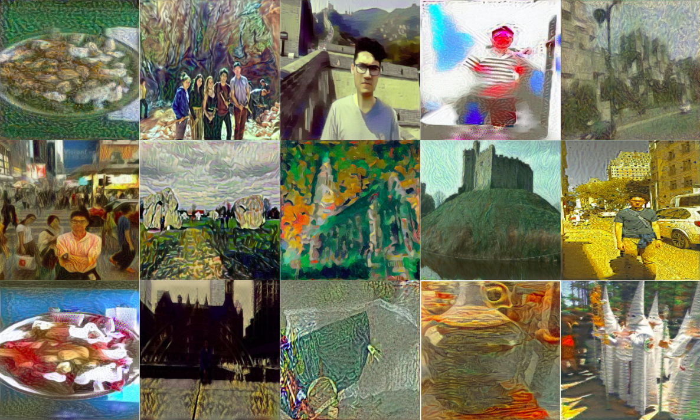

# NST INSTAGRAM

  

This app integrates Google Drive API, Tensorflow and Instagram Bot to automatically extract images from Google Drive folder, specifically paintings and your own pictures so we can train a **Neural Style Transfer** algorithm and upload pictures on Instagram, scheduled by crontab.
Just as a parenthesis, thoug is cool to have your NST photos uploaded to Instagram, the **main goal of this app is to store data on best hyperparameters** (using logs.csv file).

  

# Connecting with Google Drive
We are going to use Google Drive API. So we have to enable it. We want it to be a Desktop app. Once done that we can download the credentials.json. This one includes the Client ID and Client Secret.
Once finished open the google_api.py file and place your `path_content` and `path_style` from your Google drive on the related variables. That is pretty much you have to do regarding Google API.

## Neural Algorithm of Artistic Style
In order to understand neural style transfer we are going to use Gatys, Ecker & Bethge (2015) paper. For image processing we are going to use Convolutional Neural Networks (CNN), a class of Deep Neural Networks. CNN is about processing small units of visual information in a feed-forward manner. They are basically image filters, that extract specific characteristics of the given image. We can extract the information that each layer contains. Higher layers capture high-level content called **content representation**. 
For the style we have to use a feature space designed to capture TEXTURE inforamtion, built on top filter responses in each layer, and then computing the correlations. These feature correlations are given by a gram matrix. This paper uses 5 layers from the VGG architecture for the content characteristics and from style iterates over one to 5 layers. 

> Content and Style is separable in Convolutional Neural Networks.

The loss function contains a term for content and a term for style. Strong style importance will care on transfering style while strong content will care on keeping content, the point is to find the trade-off or ratio alpha/beta, that are the weights for the loss of the content and the loss of the style respectively. To generate the texture that matches the style, gradient descent has been used by minimizing the mean square distance between the original gram matrix and the generated image gram matrix. 
For more information visit this [paper](https://arxiv.org/pdf/1508.06576.pdf)

## Structure of the application and how to use
You need python 3 and all the requirements installed from the requirements.txt. In order to run this script scheduled you will need a Linux distro plus two folders created under a prd (or change script on both python (.py) files):
* output: Here final images 1080x1080 will be stored. Should also create output_log folder. The latter is a folder to store a 300x300 images from every 100 steps (1 epoch).
* prod_folder: Here the images from Google Drive will be stored.
You should also need to create a file such as style_name.json, with Google Drive name of the style picture as key and the name of the painting and style, that will be uploaded as the caption of the photo on Instagram.

## Instagram Bot 
Instabot is being used, this easily upload photos just add you `username` and `password` to the script.  
I would definitely recommend you check all the scripts used when you use passwords in scripts, since your information might be stolen.

## Setting crontab jobs on linux
Type `sudo crontab -e` and select your editor. The add the follwing line: 1 2 3 4 5 /path/to/script, just remember to change the path script to teh bash file **run_neural_style_transfer.sh**. I am running daily scripts, but probably you want to run hourly, so here are the rules for crontab scheduling: 
* 1: Minutes (0-59)
* 2: Hours (0-23)
* 3: Days (1-31)
* 4: Month (1-12)
* 5: Day of the week(1-7)
 
For example I want it to be run daily at 6pm. Then I shall write this `0 18 * * * run_neural_style_transfer.sh` In case the latter file on home. Remember to save and exit.

## Next Steps and how you can improve the app.
Fork the code, make the modifications and do a Pull Request, specifically on:
* Make sure images are not rotated, either code base or implement a whole deep learning module for image rotation detection (which might not be needed but cool to implement).
* Improve containerization of the application, so would be easier to deploy on the cloud, test for vulnerabilities.
* Request more logs.csv data to find the right hyperparameters. My first intuition was using DRL to make hyperparameter optimization.
* Add an ofline module or/and deploy the model you have found to have the right hyperparameters.
* Send your logs.csv information.
